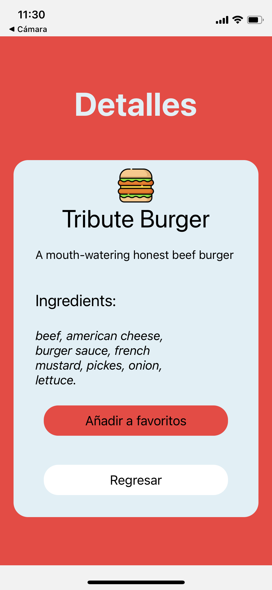

# POCAPP

Aplicacion desarrollada en React Native, usando Expo y Typescript

### Prerequisitos

Se recomienda contar con las siguientes versiones instaladas:

```
version de Node: 14.2.0
version de React Native: 0.69.4
version de Expo: 46.0.8
```

### Instalación

Para uso del proyecto requerimos clonar este repositorio. Siga los pasos:

1. Clonamos el repositorio con ayuda de git

```
git clone https://github.com/johanncepeda9816/pocapp.git
```

2. Accedemos a la carpeta donde hemos clonado

```
cd pocapp
```

3. Compilamos nuestro proyecto para generar el target

```
npm install
```

4. Abrimos el proyecto con nuestro editor de preferencia

```
code .
```

5. Para ejecutar el proyecto simplemente ejecutamos

```
expo start
```

6. y escaneamos el codigo QR con el celular, si es IOS con la camara, si es Android usar una app

## Imagenes

Home


Favorites


Detalles del producto


Detalles desde favoritos


## Programa hecho con

- [React Native](https://maven.apache.org/) - Dependency Management

## Actor

- **Johann Cepeda** - [johanncepeda9816](https://github.com/johanncepeda9816)

## Licencia

El proyecto fue construido para la prueba técnica y no debe ser usado para otros fines.
